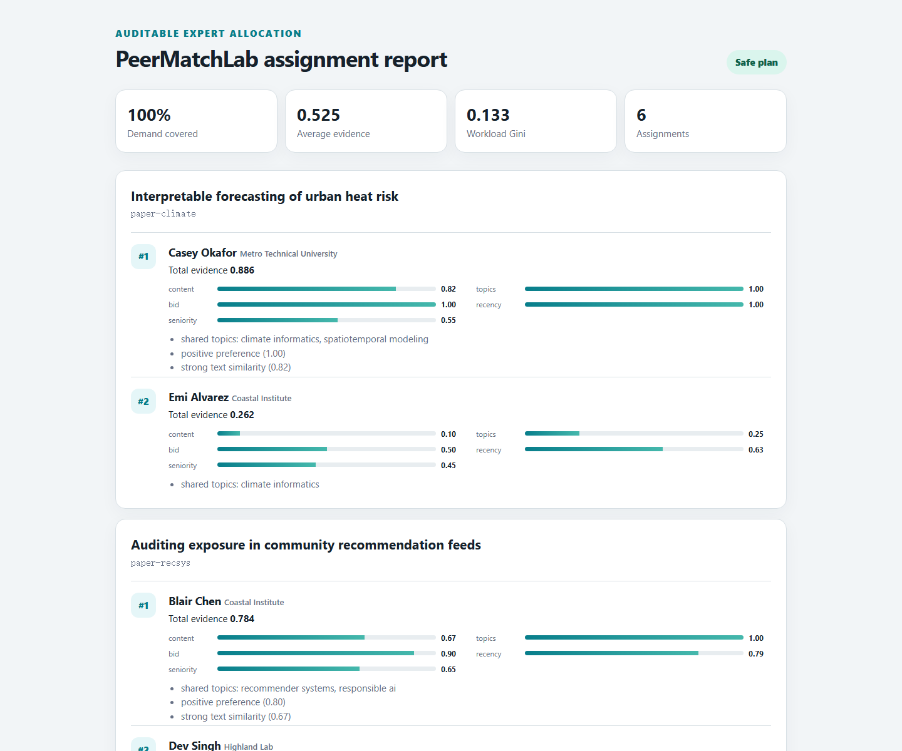
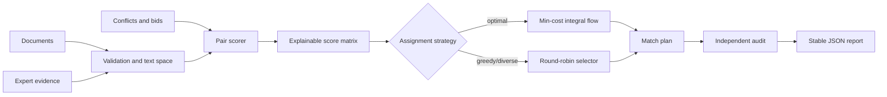

# PeerMatchLab

[](https://github.com/appleweiping/PeerMatchLab/actions/workflows/ci.yml)
[](https://github.com/appleweiping/PeerMatchLab/actions/workflows/codeql.yml)
[](https://www.python.org/)
[](LICENSE)

PeerMatchLab is a transparent, offline toolkit for matching documents to qualified experts under hard conflicts, expert capacities, score thresholds, and optional institution-diversity constraints. It is designed for review panels, grant triage, mentor discovery, speaker selection, and other workflows where a ranked similarity list is not enough: every selected pair must be explainable and the complete assignment must be auditable.

The package uses only the Python standard library at runtime. It never uploads text, calls an embedding service, or requires an API key.



## Why it exists

Most matching prototypes stop after computing pairwise similarity. Real allocation has a second, global problem: the individually strongest expert may be wanted by every document, some pairs are forbidden, and each document still needs enough reviewers. PeerMatchLab deliberately separates these concerns:

1. **Evidence** produces a decomposed score for every document–expert pair.
2. **Eligibility** removes declared conflicts and unavailable experts.
3. **Assignment** optimizes selections under document demand and expert capacity.
4. **Audit** re-checks the result without trusting the assignment engine.

## Features

- Unicode-aware tokenization and deterministic, run-local TF-IDF vectors.
- Content similarity, explicit topic overlap, bid preference, publication recency, and seniority components.
- Exact hard-conflict and zero-capacity exclusion before optimization.
- Integral min-cost-flow assignment that maximizes total score.
- Exact or round-robin assignment with optional per-document institution diversity.
- Per-document demand overrides and minimum acceptable score thresholds.
- Independent checks for conflict, capacity, demand, references, duplicate assignments, coverage,
  workload inequality, and institution duplication.
- Strict JSON and JSONL adapters with unknown-field and duplicate-ID rejection.
- Sparse external affinity CSV input for integration with independently trained expertise models.
- `validate`, `score`, `match`, `match-affinity`, `audit`, and
  `import-openreview` CLI commands.
- Stable JSON output suitable for review, version control, and downstream systems.

## Quick start

Clone the repository and run the included example:

```bash
python -m venv .venv
source .venv/bin/activate          # Windows: .venv\Scripts\activate
python -m pip install -e .

peermatch validate \
  --documents examples/documents.json \
  --experts examples/experts.json \
  --conflicts examples/conflicts.json

peermatch match \
  --documents examples/documents.json \
  --experts examples/experts.json \
  --conflicts examples/conflicts.json \
  --config examples/config.json \
  --output match-plan.json \
  --scores score-matrix.json \
  --html match-report.html
```

Inspect one pair without running a separate service:

```bash
peermatch score \
  --documents examples/documents.json \
  --experts examples/experts.json \
  --document-id paper-search \
  --expert-id expert-a
```

The response separates the total from its evidence:

```json
{
  "components": {
    "bid": 1.0,
    "content": 0.5680566396733857,
    "recency": 0.89,
    "seniority": 0.75,
    "topics": 1.0
  },
  "eligible": true,
  "reasons": [
    "shared topics: information retrieval, machine learning",
    "positive preference (1.00)",
    "strong text similarity (0.57)"
  ],
  "total": 0.7606181916507269
}
```

## Architecture



The public modules have intentionally narrow responsibilities:

| Module | Responsibility |
|---|---|
| `models` | Immutable domain objects and validation invariants |
| `text` | Tokenization, TF-IDF fitting, sparse vectors, similarity |
| `scoring` | Pair eligibility, component scoring, explanations |
| `assignment` | Capacity-constrained optimal and greedy selection |
| `audit` | Coverage, safety, workload, and diversity diagnostics |
| `io` | Strict JSON/JSONL parsing and stable result serialization |
| `affinity` | Strict sparse affinity CSV adapter |
| `openreview` | Loss-aware conversion of local OpenReview exports |
| `pipeline` | One-call score → assign → audit orchestration |
| `cli` | Reproducible command-line workflows |
| `report` | Portable, script-free HTML review dashboard |

## Scoring model

For an eligible pair, the total score is a normalized weighted sum:

```text
score = wc·content + wt·topics + wb·bid + wr·recency + ws·seniority
```

| Component | Range | Meaning |
|---|---:|---|
| `content` | 0–1 | Cosine similarity in the run-local TF-IDF space |
| `topics` | 0–1 | Jaccard overlap of explicit topics and keywords |
| `bid` | 0–1 | Expert preference mapped from the input range −1–1; an absent bid is neutral |
| `recency` | 0–1 | Mean exponential decay of dated publication evidence |
| `seniority` | 0–1 | Caller-provided experience signal; optional and low-weight by default |

Weights are normalized automatically. When an explicit weight mapping omits a component, that component has zero weight. A score is evidence for ranking, not proof of competence. Sensitive attributes should not be placed in free text or used as score inputs.

## Global assignment

`optimal` builds an integral flow network:

```text
source → document demand → eligible pair → expert capacity → sink
```

Pair costs are the negative fixed-point score, so minimum-cost flow maximizes total evidence while satisfying as much demand as the graph permits. If there is insufficient eligible capacity, the plan reports exact `unmet` counts instead of silently duplicating experts.

`greedy` is a deterministic round-robin baseline. With `require_distinct_institutions`, the optimal network inserts a capacity-one node for each document–institution pair before the expert nodes. This enforces the group constraint globally without abandoning the score objective. Experts whose institution is unknown receive separate group nodes, avoiding an unsupported assumption that they share an affiliation. Institution values are compared as exact strings, so callers should normalize aliases upstream and use `null` for unknown affiliations. The reported strategies are `optimal-diverse` and `greedy-diverse`.

Set `load_balance_penalty` between `0` and `1` to trade a controlled amount of affinity for a more even workload. Each additional assignment to the same expert incurs one more penalty unit (`penalty * current_load`) in the optimization objective. The optimal solver models these convex marginal costs directly in the flow network; the greedy baseline applies the same adjustment at selection time. A value of `0` preserves the unadjusted score objective. Strategy names add `-balanced` when the control is active so exported plans remain self-describing.

### Reserving slots for senior reviewers

`minimum_senior_reviewers` reserves that many of each document's slots for experts whose `seniority` is at
least `senior_threshold` (default `0.75`). It is a hard constraint, not a preference. The optimal solver
splits each document's demand at the source: reserved units leave through an arc that reaches only senior
pair nodes, so they cannot be spent on a junior expert, while the remaining units reach every eligible pair.
Both sides meet at one capacity-one node per document-expert pair, which is what stops an expert from
filling a reserved slot and a free slot for the same document.

```json
{"reviewers_per_document": 3, "minimum_senior_reviewers": 1, "senior_threshold": 0.8}
```

The objective is unchanged, so within the reservation the plan is still the highest-scoring one available.
That is checked by exhaustive search over small instances rather than assumed: satisfying a constraint is
easy if score may be given up freely, and only enumeration shows nothing better was on offer.

A reserved slot that no senior expert can fill stays unmet rather than being handed to a junior. A document
whose only remaining candidates are junior therefore comes back partly filled with an exact `unmet` count,
the same way insufficient eligible capacity already does. The greedy baseline honours the same floor, by
considering only senior experts once every remaining round is needed to reach it. Strategy names gain
`-senior` so exported plans stay self-describing.

`minimum_senior_reviewers` cannot be combined with `require_distinct_institutions`, and the combination is
refused rather than approximated. The two are not jointly expressible in this flow network: the reservation
needs reserved units to keep their identity all the way to a senior pair, while institution diversity needs
a capacity-one gate between the document and those pairs, and a unit passing through that gate no longer
carries which side of the split it came from. A network merging them would satisfy one constraint and
quietly relax the other, which is worse than saying so.

## Input formats

Each input accepts either a JSON array or one JSON object per line.

Minimal document:

```json
{"id": "doc-1", "title": "Efficient retrieval"}
```

Minimal expert:

```json
{"id": "expert-1", "name": "Ada", "capacity": 2}
```

Hard conflict:

```json
{"document_id": "doc-1", "expert_id": "expert-1", "reason": "recent collaborator"}
```

See [`examples/`](examples) for the complete schema, including publications, topics, bids, institutions, per-document demand, and metadata.

### External affinity matrices

When another system already computes paper–reviewer affinity, use a sparse CSV rather than converting
the score into profile text:

```csv
document_id,expert_id,score
paper-1,reviewer-a,0.82
paper-1,reviewer-b,0.71
```

```bash
peermatch match-affinity \
  --documents documents.json --experts experts.json \
  --conflicts conflicts.json --affinities affinities.csv \
  --config config.json --output plan.json --html plan.html
```

Scores must be finite and in `[0, 1]`. Missing pairs remain absent rather than becoming zero-score
candidates. Hard conflicts, capacities, demand, minimum score, institution diversity, assignment audit,
and deterministic tie breaking are applied exactly as in text-derived matching. The CSV producer remains
responsible for the validity, calibration, and provenance of its affinity model.

The canonical header is optional. Headerless `paper ID, profile ID, score`
rows produced by the OpenReview expertise workflow can therefore be consumed
without rewriting them. External affinity is preserved as an `affinity`
component in assignment explanations; it is not mislabeled as TF-IDF content.

### Local OpenReview exports

An offline adapter converts API-v1 or API-v2-shaped submission-note JSONL and a newline-delimited
reviewer-ID file into PeerMatchLab's explicit interchange format:

```bash
peermatch import-openreview \
  --submissions submissions.jsonl \
  --reviewers reviewer-ids.txt \
  --reviewer-capacity 4 \
  --directory scratch/openreview
```

The adapter performs no authentication or network requests. It unwraps OpenReview v2 `value` fields,
accepts both common `subject_area` and `subject_areas` fields, preserves note/forum identifiers,
and rejects duplicate JSON fields and submission IDs. Reviewer shells
carry only identifiers and capacity; they do not pretend to contain expertise. Generate affinity scores
separately, then pass the sparse CSV to `match-affinity`. Keep private submissions and reviewer identities
outside public repositories and follow the venue's data-governance rules.

The adapters validate scalar types rather than coercing them: identifiers and text must be strings,
counts must be JSON integers (not booleans), and numeric controls must be finite.

## Python API

```python
from peermatchlab.config import MatchConfig
from peermatchlab.io import load_conflicts, load_documents, load_experts
from peermatchlab.pipeline import run_matching

run = run_matching(
    load_documents("examples/documents.json"),
    load_experts("examples/experts.json"),
    conflicts=load_conflicts("examples/conflicts.json"),
    config=MatchConfig(reviewers_per_document=2),
)

assert run.audit.safe
for assignment in run.plan.assignments:
    print(assignment.document_id, assignment.expert_id, assignment.score)
```

## Reproducibility and safety

- Text fitting, pair ordering, optimization costs, tie breaking, and JSON output are deterministic.
- Unknown fields and duplicate identifiers are errors rather than ignored input.
- Conflicts are removed before assignment and checked again afterward.
- `audit` can inspect a plan produced by another system and marks unknown references, duplicate pairs,
  excess document assignments, conflicts, and capacity overruns as unsafe.
- No model downloads, network calls, hidden mutable cache, or ambient random seed are used.

PeerMatchLab does **not** infer conflicts, demographic fairness, authorship, identity, or expertise truth. Human operators remain responsible for data quality, declared conflicts, final selections, appeals, and applicable policy.

## Development

```bash
python -m pip install -e ".[dev]"
ruff check .
ruff format --check .
mypy src
pytest --cov=peermatchlab --cov-report=term-missing
python -m build
```

The CI matrix runs supported Python versions and enforces formatting, strict typing, tests, branch coverage, and package construction. See [CONTRIBUTING.md](CONTRIBUTING.md) before opening a change.

## Roadmap

- Optional calibrated embedding adapters without making a hosted service mandatory.
- Group constraints beyond institution diversity and senior coverage, where they can be
  expressed exactly rather than approximated.
- Interactive what-if reports for capacity and conflict changes.
- Import/export adapters for common review-management schemas.

## License

PeerMatchLab is available under the [MIT License](LICENSE).
